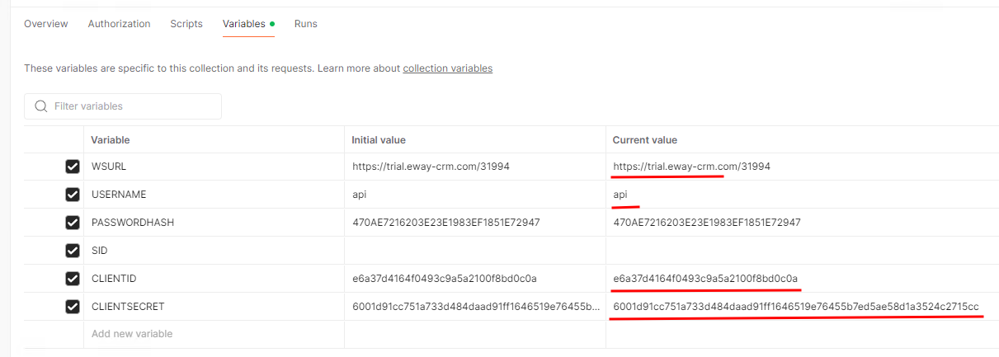
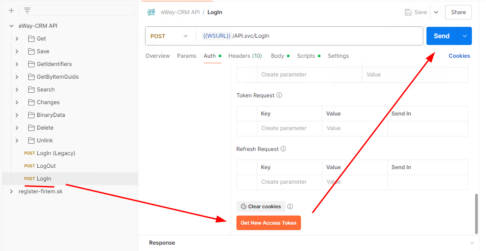
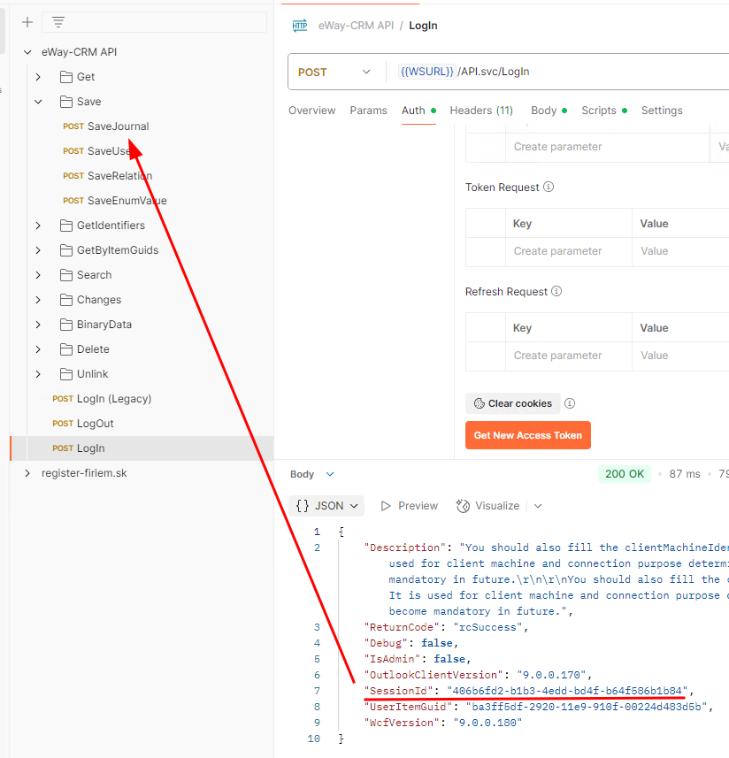

# eWay-CRM API

## First Steps

Visit the [eWay-CRM website](https://www.eway-crm.com) and sign up for a free trial.

Fork our [Postman collection](https://eway.cr/postman).

Ask our [support](mailto:support@eway-crm.com) to generate ClientID / ClientSecret for you.
Or use our test service:
* **WS URL**: https://trial.eway-crm.com/31994
* **UserName**: api
* **Password**: ApiTrial@eWay-CRM

> [!NOTE]
> See [Howto find Web Service URL](https://www.eway-crm.com/resources/how-to-use-eway-crm/set-or-change-web-service-address/).
> For production use we recommend to see [Howto create a new user just for API integration](https://kb.eway-crm.com/en/faq-1/installation/how-to-create-api-user).

Fill in your details in the Postman *Variables* tab:



Go to *Login* method and inside Auth tab click *Get New Access Token*. While you login
use the same user name as you previously specified in Postman *Variables*.



As soon as you have *Access Token* click *Send* to create new session.

With a session being generated you can start calling other methods eg. *SaveJournal* to create a new Journal in eWay-CRM.



## Docs

### Swagger


Postman collection does contain all available methods.
But you can use [Swagger Documentation](https://swagger.eway-crm.io/) to view all available API methods.

### DB Schema


It might be useful to look at [eWay-CRM Database Schema](https://dev.eway-crm.com/docs/database-schema.html).

Also see [FolderNames](FolderNames.md) for list of supported modules in eWay-CRM.

## Libraries

Depending on the technology you use you can pick one of our libraries.

### .NET, C#, F#, PowerShell


.NET developers may download our [NuGet package](https://www.nuget.org/packages/eWayCRM.API) and start coding.

```
dotnet add package eWayCRM.API
```

For basic samples in C# go to [csharp-lib repository](https://github.com/eway-crm/csharp-lib).

### JavaScript


JavaScript developers may leverage [@eway-crm/connector](https://www.npmjs.com/package/@eway-crm/connector).

```
npm i @eway-crm/connector
```

### PHP


Even thought not complete, PHP developers may include [eway.class.php](https://github.com/eway-crm/php-lib).

```
// Load API
require_once "eway.class.php";

// Create connector
$connector = new eWayConnector('https://trial.eway-crm.com/31994', 'api', 'ApiTrial@eWay-CRM');
```

## Support

New eWay-CRM version upgrades may introduce some [Breaking Changes](Breaking%20Changes.md). Please read them carefully.

For general API question you may raise [issues](https://github.com/eway-crm/api/issues) in this repository.
If you use one of our libraries post the questions there:
* [.NET](https://github.com/eway-crm/csharp-lib/issues)
* [JavaScript](https://github.com/eway-crm/js-lib/issues)
* [PHP](https://github.com/eway-crm/php-lib/issues)